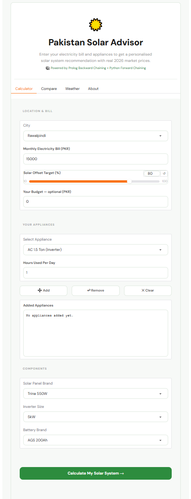
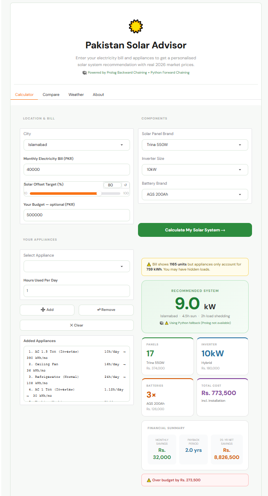
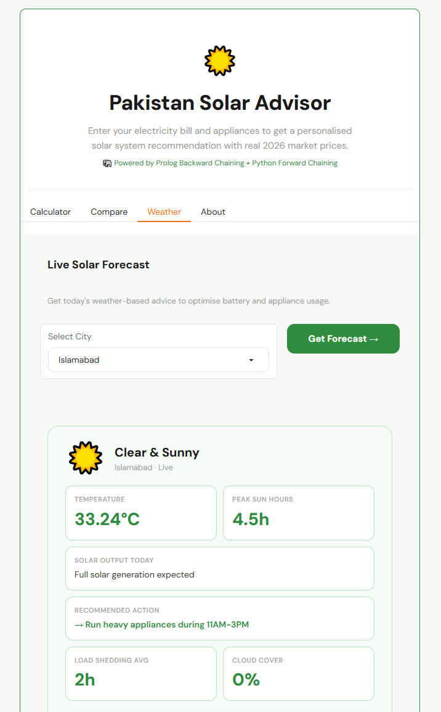

# Pakistan Solar ROI Advisor

<p align="center">
  
</p>

Pakistan Solar ROI Advisor is an AI-powered expert system that helps homeowners estimate the ideal rooftop solar installation based on their electricity usage, location, and energy requirements. Built using Python, SWI-Prolog, and Gradio, the application combines rule-based reasoning, live weather data, and engineering calculations to generate personalized solar recommendations, estimate installation costs, and calculate long-term return on investment.

The project was inspired by a common problem in Pakistan: homeowners often need to contact multiple solar companies, wait for quotations, and compare different recommendations before deciding on a system. Pakistan Solar ROI Advisor simplifies this process by acting as a virtual solar consultant, providing intelligent, data-driven recommendations instantly through an interactive web application.

---

## Overview

The application analyzes electricity consumption, budget, city, and environmental conditions to recommend an appropriate solar system configuration. It estimates system size, panel count, inverter capacity, battery requirements, installation costs, monthly savings, and payback period while adapting recommendations using live weather information.

By combining artificial intelligence with practical engineering knowledge, the system makes solar planning faster, more accessible, and easier to understand for everyday users.

---

## Features

### Intelligent Solar Planning

- Personalized solar system sizing
- Solar panel recommendations
- Inverter and battery selection
- Installation cost estimation
- Monthly savings calculation
- Return on Investment (ROI)
- Payback period analysis

### AI Expert System

- Rule-based reasoning using SWI-Prolog
- Backward and Forward Chaining
- Knowledge-based decision making
- Python fallback when Prolog is unavailable

### Localized Recommendations

- Support for major Pakistani cities
- Temperature derating
- Load-shedding considerations
- Local market pricing
- Live weather integration

---

## AI Reasoning

The recommendation engine combines **Backward Chaining** and **Forward Chaining** to emulate the decision-making process of a solar consultant.

Backward Chaining begins with the user's desired outcome and works backward through the knowledge base to determine the appropriate solar system size, panel count, inverter rating, battery capacity, and expected financial return.

Forward Chaining uses live weather conditions to trigger production rules that generate practical recommendations for battery usage, appliance scheduling, and maximizing solar energy generation under different environmental conditions.

The system also incorporates engineering heuristics such as temperature derating, standard inverter sizing, battery sizing based on load-shedding duration, and equipment recommendations using real market specifications.

---

## Application Preview

<table align="center">
<tr>

<td align="center">
<b>Solar Recommendation</b><br><br>

</td>

<td align="center">
<b>Weather Advisor</b><br><br>

</td>

</tr>
</table>

The expert system generates personalized solar recommendations based on user requirements and city-specific conditions, while the Weather Advisor integrates live weather data to provide practical guidance for improving solar generation and battery management.

---

## Technology Stack

**Artificial Intelligence**

- SWI-Prolog
- Rule-Based Expert Systems
- Backward Chaining
- Forward Chaining

**Programming Language**

- Python

**User Interface**

- Gradio

**API Integration**

- OpenWeatherMap API

---


## Project Structure

```text
Pakistan-Solar-ROI-Advisor/
├── screenshots/          # Application screenshots used in the README
├── solar_advisor/
│   ├── appliances.pl      # Appliance knowledge base
│   ├── batteries.pl       # Battery specifications and rules
│   ├── city_data.pl       # City-specific weather and solar data
│   ├── inverters.pl       # Inverter specifications
│   ├── loadshedding.pl    # Load-shedding information
│   ├── panels.pl          # Solar panel specifications
│   ├── solar_engine.pl    # Main expert system and inference rules
│   ├── solar_gui_prolog.py# Python + Gradio interface
│   └── tariffs.pl         # NEPRA electricity tariff rules
└── README.md
```

## Learning Outcomes

This project strengthened my understanding of:

- Expert Systems
- Knowledge Representation
- Rule-Based Artificial Intelligence
- Backward and Forward Chaining
- Integrating Python with SWI-Prolog
- API Integration
- Financial Modeling
- Building AI-powered decision support systems

---

## Future Improvements

- Net-metering calculations
- Lithium-ion battery recommendations
- Additional Pakistani cities
- Multi-day weather forecasting
- PDF report generation
- Machine learning-based energy demand prediction

---

## Author

**Fatima Niazi**
