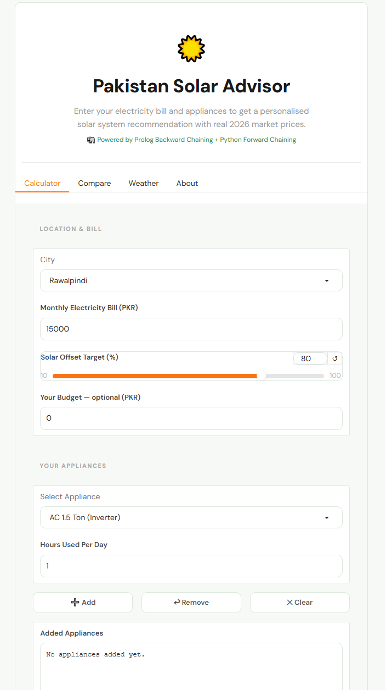
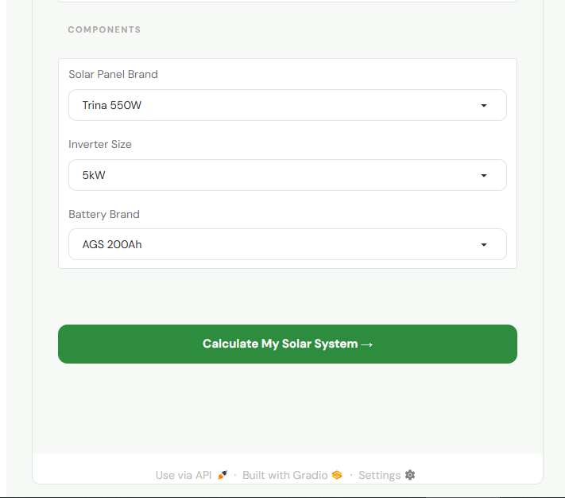
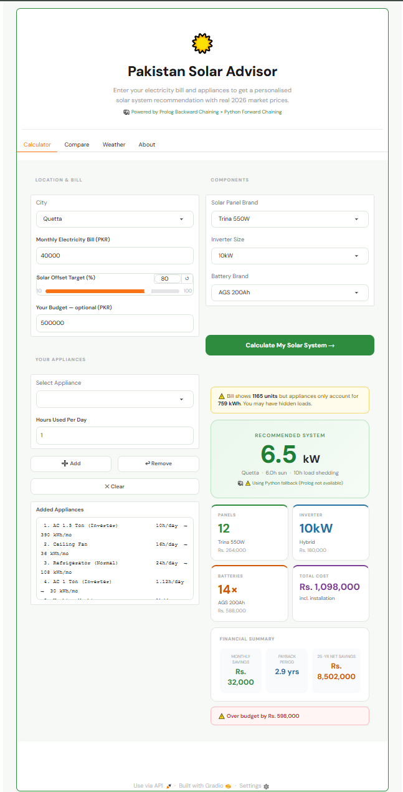
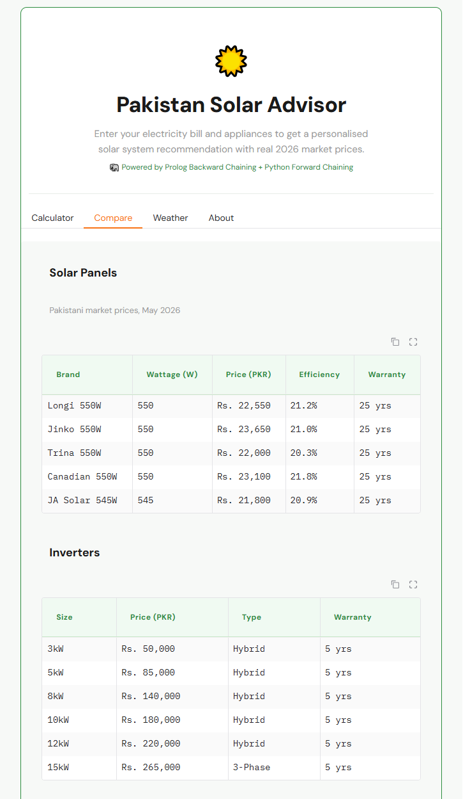

# Pakistan Solar ROI Advisor


Pakistan Solar ROI Advisor is an AI-powered expert system built using Python, SWI-Prolog, and Gradio that helps homeowners estimate the optimal rooftop solar installation for their energy needs. By combining rule-based reasoning, live weather data, and localized engineering calculations, the application recommends suitable solar systems, estimates installation costs, and calculates long-term financial savings.

The project was developed to address a practical problem faced by many homeowners in Pakistan—obtaining accurate solar system recommendations often requires contacting multiple vendors, waiting for quotations, and comparing different opinions. Pakistan Solar ROI Advisor simplifies this process by providing intelligent, data-driven recommendations instantly through an interactive web application.

---

## Overview

Pakistan's growing energy demands and increasing electricity costs have led many homeowners to consider solar energy. However, determining the appropriate system size, expected installation cost, and financial return can be difficult without consulting multiple solar providers.

Pakistan Solar ROI Advisor serves as a virtual solar consultant by combining artificial intelligence with real-world engineering knowledge. The application analyzes electricity usage, location, weather conditions, and financial goals to recommend a suitable solar installation while estimating monthly savings, return on investment, and equipment requirements.

---

## Features

### Intelligent Solar Recommendations

- Personalized solar system sizing
- Solar panel recommendations
- Inverter selection
- Battery capacity estimation
- Installation cost calculation
- Return on Investment (ROI)
- Payback period estimation

### AI Expert System

- Rule-based reasoning using SWI-Prolog
- Backward Chaining
- Forward Chaining
- Knowledge-based decision making
- Python fallback when Prolog is unavailable

### Localized Recommendations

- Support for major Pakistani cities
- City-specific weather conditions
- Temperature derating calculations
- Load-shedding considerations
- Local market pricing

### Financial Analysis

- Electricity bill to energy consumption conversion
- Monthly electricity savings
- Installation cost estimation
- Lifetime savings projection
- Twenty-five-year ROI analysis

### Weather Integration

- Live weather using OpenWeatherMap API
- Daily solar generation advice
- Weather-aware appliance recommendations
- Battery conservation suggestions

---

## AI Reasoning

### Backward Chaining

The expert system begins with the user's desired outcome and works backward through the knowledge base to determine the optimal solar system size, number of panels, inverter rating, battery capacity, and expected financial return.

### Forward Chaining

Current weather conditions are converted into facts that trigger production rules to generate intelligent recommendations for battery usage, appliance scheduling, and energy conservation based on environmental conditions.

### Engineering Heuristics

The recommendation engine incorporates practical engineering assumptions including:

- Standard inverter sizing
- Temperature derating
- Solar panel efficiency
- Battery sizing based on load-shedding
- Balance-of-system installation costs
- Equipment sizing using real market specifications

---

## Application Preview

### Main Advisor Interface

The main dashboard provides access to the Solar Calculator, Weather Advisor, and Market Comparison tools through a simple and interactive interface.


---

### Solar Calculator

Users enter their electricity bill, city, budget, and energy requirements to generate personalized solar recommendations.



---

### Hardware Recommendation

Based on the user's requirements, the system recommends an appropriate solar system configuration, including panel count, inverter capacity, battery size, estimated installation cost, monthly savings, and expected return on investment.



---

### Solar Recommendation Results

The expert system generates localized recommendations using engineering calculations and city-specific conditions.

**Islamabad Recommendation**


**Quetta Recommendation**



---

### Weather Advisor

The Weather Advisor integrates live weather information to provide recommendations that help users maximize solar energy production and improve battery management.


---

### Market Comparison

Users can compare different solar panel, battery, and inverter options based on price, specifications, and estimated performance.



---

## Technology Stack

### Artificial Intelligence

- SWI-Prolog
- Backward Chaining
- Forward Chaining
- Rule-Based Expert Systems

### Programming Language

- Python

### User Interface

- Gradio

### APIs

- OpenWeatherMap API

### Concepts

- Expert Systems
- Knowledge Representation
- Inference Engines
- Financial Modeling
- Weather Integration

---

## Project Structure

```text
Pakistan-Solar-ROI-Advisor/
├── screenshots/
├── solar_gui.py
├── solar_engine.pl
└── README.md
```

---

## Learning Outcomes

This project strengthened my understanding of:

- Expert Systems
- Rule-Based Artificial Intelligence
- Backward and Forward Chaining
- Knowledge Representation
- Integrating Python with SWI-Prolog
- API Integration
- Financial Modeling
- Designing AI-powered decision support systems for real-world applications

---

## Future Improvements

- Lithium-ion battery recommendations
- Net-metering calculations
- Support for additional Pakistani cities
- Multi-day weather forecasting
- PDF report generation
- Dynamic electricity tariff updates
- Machine learning-based energy demand prediction

---

## Author

**Fatima Niazi**
